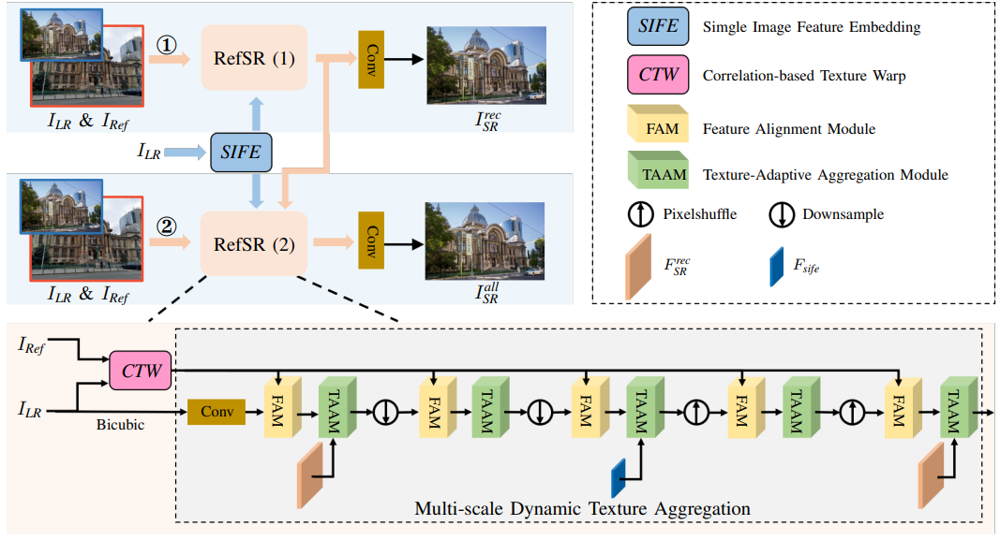
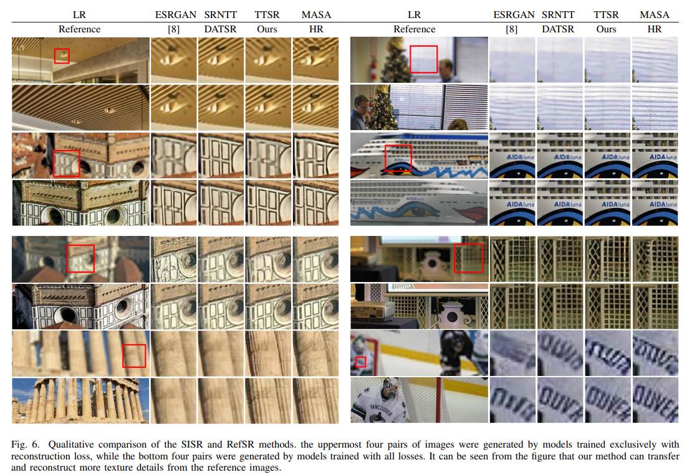

# FRFSR
A Feature Reuse Framework for Reference-based Super-Resolution with Texture-adaptive Aggregation

# FRFSR
[arxiv](http://arxiv.org/abs/2306.01500)

## Overview


## Dependencies
- Python >=3.7
- Pytorch == 1.7.1

## Training and Test
Because our code is heavily derived from [C2-Matching](https://github.com/yumingj/C2-Matching), you can easily use our code to replace and train or test on C2-matching.

## Visual Results


## Citation
  ```
@article{mei2023feature,
  title={A Feature Reuse Framework with Texture-adaptive Aggregation for Reference-based Super-Resolution},
  author={Mei, Xiaoyong and Yang, Yi and Li, Ming and Huang, Changqin and Zhang, Kai and Li{\'o}, Pietro},
  journal={arXiv preprint arXiv:2306.01500},
  year={2023}
}
  ```
## License and Acknowledgement

This project is open sourced under MIT license. We refer to codes from [C2-Matching](https://github.com/yumingj/C2-Matching), [DATSR](https://github.com/caojiezhang/DATSR) and [BasicSR](https://github.com/xinntao/BasicSR). Thanks for their awesome works.
